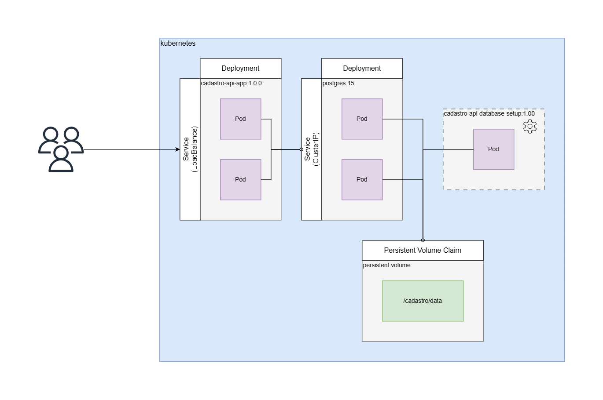

# Projeto: Cadastro

Objetivo desse projeto é criar uma API de cadastro utilizando o CSM strapi, virtualizando os serviços em docker e instalar em um cluster utilizando kubernetes.

## Visão macro do projeto

Para auxiliar no entendimento da solução e desenvolvimento dos componentes, segue o diagrama abaixo:

